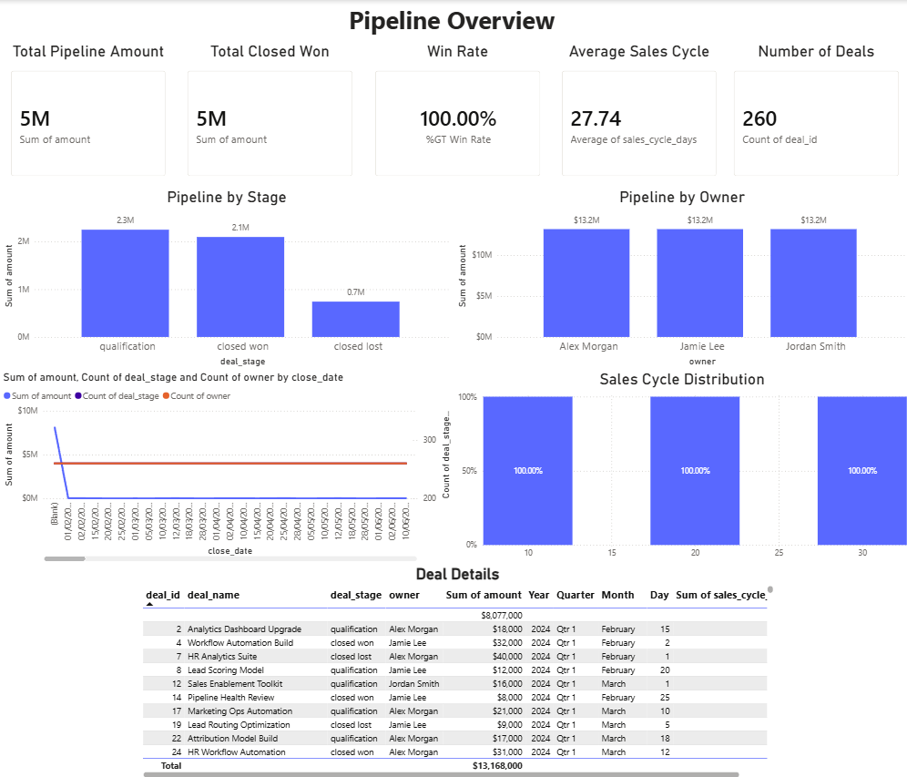
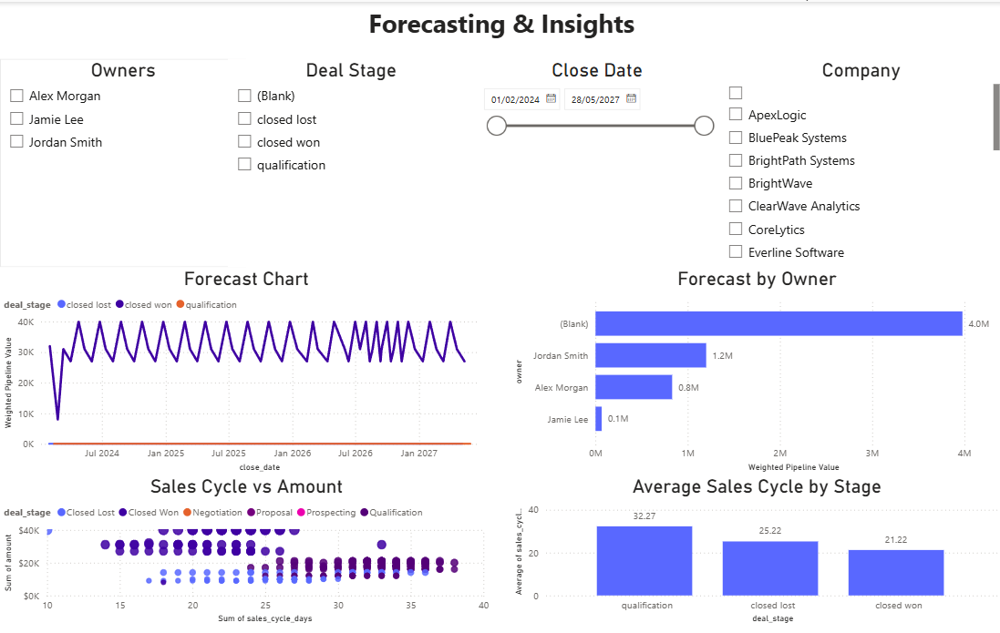

# Sales Pipeline & Revenue Dashboard  
### Simulated HubSpot CRM Data — End-to-End Analytics Project

---

## Executive Summary

This project delivers a complete analytics workflow that mirrors real-world Revenue Operations (RevOps) reporting.  
Using simulated HubSpot CRM data, I built a fully cleaned analytical dataset, engineered key performance metrics, and developed a multi-page Power BI dashboard that provides actionable insights into revenue forecasting, pipeline health, and sales performance.  
The goal: demonstrate strong analytical thinking, technical capability, and the ability to communicate insights clearly to business stakeholders.

---

## Badges

---

## Table of Contents
- [Project Overview](#project-overview)
- [Business Impact](#business-impact)
- [Key Business Questions](#key-business-questions)
- [Tools and Technologies](#tools-and-technologies)
- [Data Preparation](#data-preparation)
- [Dashboard Preview](#dashboard-preview)
- [Download Dashboard Files](#download-dashboard-files)
- [How to Reproduce This Project](#how-to-reproduce-this-project)
- [Repository Structure](#repository-structure)
- [Future Enhancements](#future-enhancements)
- [Insights Summary](#insights-summary)
- [Contact](#contact)

---

## Project Overview

This project analyzes a simulated sales pipeline to uncover:

- Revenue outlook and forecast accuracy  
- Pipeline health and deal quality  
- Sales cycle efficiency  
- Owner performance  
- Stage-level bottlenecks  

Deliverables include:

- A multi-page Power BI dashboard  
- A fully cleaned and merged dataset (`pipeline_model.csv`)  
- Documented insights (`INSIGHTS.md`)  
- Reproducible Python notebooks  

---

## Business Impact

This dashboard provides value to sales and revenue teams by:

- Highlighting revenue risks early through forecast visibility  
- Identifying bottlenecks that slow down deal progression  
- Revealing which owners drive the most revenue  
- Quantifying sales cycle efficiency to support process improvements  
- Enabling leadership to make data-driven decisions about pipeline strategy  

This mirrors the type of reporting used in real RevOps and Sales Operations environments.

---

## Key Business Questions

- What is the projected revenue for upcoming periods?  
- Which sales owners contribute most to the forecast?  
- How long does it take deals to close?  
- Are larger deals taking longer to close?  
- Where are the biggest drop-offs in the pipeline?  

---

## Tools and Technologies

- **Python (pandas)** — data cleaning & modeling  
- **Jupyter / VS Code** — notebook development  
- **Power BI** — dashboard creation  
- **GitHub** — version control & documentation  

---

## Data Preparation

All data cleaning and modeling steps are performed in:

/notebooks/03_build_pipeline_model.ipynb

Key transformations:

- Cleaned contacts & deals datasets  
- Merged on `contact_id`  
- Converted date fields  
- Engineered `sales_cycle_days`  
- Exported final dataset as `pipeline_model.csv`  

Final dataset stored in:

/data/pipeline_model.csv

---

## Dashboard Preview

### Page 1 — Pipeline Overview  

### Page 2 — Forecasting & Performance Insights  

---

## Download Dashboard Files

### Power BI Dashboard (.pbix)  
[Download pipeline_dashboard.pbix](../dashboard/pipeline_dashboard.pbix)

### Dataset (.csv)  
[Download pipeline_model.csv](../data/pipeline_model.csv)

---

## How to Reproduce This Project

1. Clone the repository  
2. Open the notebooks in `/notebooks`  
3. Install required Python libraries:  

pip install pandas

4. Run `03_build_pipeline_model.ipynb` to regenerate the dataset  
5. Open `pipeline_dashboard.pbix` in Power BI Desktop  
6. Refresh the data source to connect to your local CSV  

---

## Repository Structure

/dashboard
pipeline_dashboard.pbix
page1_pipeline_overview.png
page2_forecasting_insights.png

/data
pipeline_model.csv

/docs
README.md
INSIGHTS.md

/notebooks
01_data_cleaning.ipynb
02_exploratory_analysis.ipynb
03_build_pipeline_model.ipynb

---

## Future Enhancements

- Add DAX measures for deeper forecasting  
- Integrate SQL-based data extraction  
- Add anomaly detection for deal slippage  
- Build a Streamlit or Power BI Service version  
- Add automated data refresh pipelines  

---

## Insights Summary

A detailed breakdown of findings is available in:

/docs/INSIGHTS.md

Includes:

- Forecast trends  
- Owner performance  
- Deal quality patterns  
- Sales cycle analysis  
- Recommended actions  

---

## Contact

**Mandy Dunwoody**  
Operations & Business Analysis Specialist  
Data Analytics • Power BI • Python • SQL
